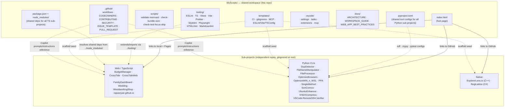
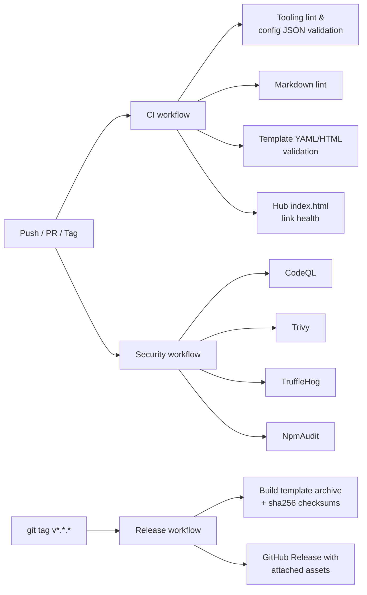

# Workspace Architecture

> **Scope**: This document describes the **root workspace** (`MyScripts/`).
> Each sub-project owns its own architecture docs inside its own repo.

## Mission

`MyScripts/` is a **generic template workspace** and a **shared tooling
aggregator**. It contains nothing that ships to end users; it ships
*conventions, configs, scripts, templates, and a developer hub* that all
sub-projects consume.

The root is **not** a deployable web app. Its only runtime surface is the
static [hub `index.html`](../index.html) for local navigation and
discoverability.

## High-level diagram

## CI flow at the root

## Key invariants

1. **No sub-project files are tracked at the root.** Each sub-project lives
   in its own GitHub repo and is cloned alongside; root `.gitignore` excludes
   all sub-project directories.
2. **Single source of truth for shared configs**, in [tooling/](../tooling/).
   Sub-projects `extends`/`import` these via `../tooling/` — never copy.
3. **One `node_modules` per machine**, at the root. Sub-projects must not run
   `npm install` locally.
4. **Root CI never depends on sub-project state** — it only validates files
   the root owns (tooling, templates, docs, scripts, hub).
5. **No secrets in repo** — use GitHub Secrets / `.env` (gitignored).
6. **Portable paths only** — no absolute paths, no `${userHome}`-specific
   values in committed configs.

## Decision log (short)

| Decision | Rationale |
|---------|-----------|
| Flat workspace (no Nx/Turborepo) | Sub-projects are independent product repos with separate release cadences; monorepo tooling would add coupling without benefit. |
| Static `index.html` at root, separate dynamic hub at `rajwanyair.github.io` | Root hub is for **local** dev navigation; live hub auto-syncs from the GitHub API. Drift is acceptable because each serves a different audience. |
| Node 22 (CI) + Python 3.9+ (root configs only) | Long-term-support versions; matches sub-project requirements. |
| `softprops/action-gh-release@v2` + sha256 sidecar | Modern, maintained action with checksum support for supply-chain integrity. |

See also: [WORKSPACE_GUIDE.md](WORKSPACE_GUIDE.md) and [ROADMAP.md](../ROADMAP.md).
