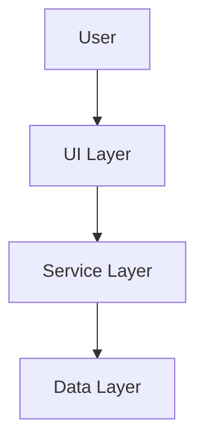

# Web App Best Practices

> **Last reviewed**: 2026-05-26 · **Reference implementation**: `WoodworkingShop/` v4.2.0
> Workspace-level reference for generic web applications built under `MyScripts/`.
> Patterns here are battle-tested in production. Apply them to all new and refreshed web projects.

## Scope

Use this guide for new or refreshed web applications in this workspace.
Covers GitHub Pages static SPAs, full React SPAs, PWAs, and hybrid apps.

Representative source projects reviewed for this consolidation:

- `BudgetManager/`, `CrossTideWeb/`, `FamilyDashBoard/`, `Wedding/`
- `WoodworkingShop/` — primary reference (React 19, TypeScript 6, production-grade)
- `SortComics/frontend/`, `rajwanyair.github.io/`
- Shared root `package.json`, `.vscode/`, `.github/`, and `tooling/`

See also: [REACT_SPA_PLAYBOOK.md](REACT_SPA_PLAYBOOK.md) for the full React SPA deep-dive.

## Default Stack

Prefer the smallest stack that fits the product.

### Default for Most Apps

- Vite 8 for dev server and production builds
- TypeScript strict mode for application and test code
- Vanilla TypeScript plus modular CSS for low-runtime-cost SPAs
- GitHub Pages for static deployment
- Vitest 4 for unit and DOM-contract testing
- ESLint 10 flat config for linting
- shared configs from `tooling/` instead of copied local rules

### Use React Only When It Pays For Itself

Choose React for component-heavy UI, complex local state graphs, or ecosystem-specific needs. When React is justified in this workspace, the current preferred stack is:

- React 19
- TypeScript
- Zustand for lightweight client state
- Testing Library for component testing
- Tailwind 4 only when utility-first styling is materially faster than semantic CSS

### Current Shared Tool Versions

The root `package.json` is the source of truth for workspace-shared JS/TS tool versions.

| Tool                  | Workspace baseline                       |
| --------------------- | ---------------------------------------- |
| Node.js               | `>=22` preferred for active web projects |
| TypeScript            | `6.0.3`                                  |
| Vite                  | `8.0.8+`                                 |
| Vitest                | `4.1.4+`                                 |
| `@vitest/coverage-v8` | `4.1.4+`                                 |
| ESLint                | `10.2.1`                                 |
| `typescript-eslint`   | `8.58.2`                                 |
| Playwright            | `1.59.1`                                 |
| Tailwind CSS          | `4.2.2`                                  |
| React                 | `19.2.5`                                 |
| React DOM             | `19.2.5`                                 |
| Zustand               | `5.0.12`                                 |
| DOMPurify             | `3.2.6`                                  |
| Valibot               | `1.0.0`                                  |
| Zod                   | `4.4.1`                                  |
| i18next               | `26.0.6`                                 |
| Prettier              | `3.8.3`                                  |
| markdownlint-cli2     | `0.22.0`                                 |
| HTMLHint              | `1.9.2`                                  |
| Stylelint             | via shared `tooling/stylelint/`          |
| commitlint            | `20.5.3`                                 |
| lint-staged           | `16.4.0`                                 |

If a child project pins an older version, treat that as project-local compatibility debt, not the generic standard.

## Workspace Model

`MyScripts/` is an umbrella workspace, not a monorepo. Each child project remains independent, but shared web tooling should converge on the root workspace defaults where practical.

### Shared Dependency Strategy

- Install JS/TS dependencies from the root workspace only
- Keep root `node_modules/` as the shared dependency store
- Do not duplicate shared lint/test/build tool versions across subprojects unless the project has a hard compatibility reason
- Prefer child project comments or docs that state they inherit shared tooling from the root workspace

### Shared Config Strategy

Child projects should extend or import shared config from `tooling/`.

- `tooling/eslint/` for lint rules
- `tooling/vitest/` for test baselines
- `tooling/vite.base.ts` for build defaults
- `tooling/playwright.base.ts` for E2E defaults
- `tooling/stylelint/base.cjs` for CSS linting
- `tooling/markdownlint.base.json` for Markdown linting
- `tooling/tsconfig/` for TypeScript baselines

Rule: extend, do not fork, unless a project genuinely differs in runtime model.

## Architecture Methods

### Preferred SPA Shape

For generic web apps, the dominant successful pattern in this workspace is a layered SPA:

```text
src/
  main.ts|js          bootstrap and lifecycle wiring
  core/               app primitives: state, events, routing, i18n, ui helpers
  sections/           feature modules with mount/unmount boundaries
  services/           backend, sync, auth, storage, external APIs
  utils/              pure helpers: validate, format, sanitize, transform
  styles/             tokens, base, components, utilities, a11y layers
  templates/          lazy HTML fragments when needed
  types/              shared domain types and contracts
```

### State Management

Default by app type:

- Vanilla TS apps: use a small custom store, event bus, or Proxy-based reactive store
- React apps: use Zustand before considering heavier state libraries
- Keep domain logic pure and framework-independent
- Treat UI as a projection of state, not the state owner

Good generic rule set:

- One clear source of truth per feature area
- Persist only stable user data to `localStorage` or indexed storage
- Keep derived values computed from state, not duplicated in state
- Keep DOM mutation localized to view/render functions

### Feature Boundaries

- Organize by feature modules, not by giant utility buckets
- Keep bootstrap code thin
- Isolate third-party API access behind service modules
- Make engine/business logic testable without a DOM

## UI and Styling Methods

### Default CSS Approach

Prefer vanilla CSS with explicit layers and design tokens for generic apps.

```css
@layer tokens;
@layer base;
@layer components;
@layer utilities;
@layer a11y;
```

Recommended conventions:

- centralize color, spacing, radius, shadow, and typography tokens in one place
- support dark mode through data attributes or root-level token swaps
- respect `prefers-reduced-motion`
- build reusable semantic components before reaching for utility sprawl
- use container queries where card/module layouts benefit from local responsiveness

### Tailwind Guidance

Tailwind is supported, but it is not the generic default for this workspace.

- Use Tailwind 4 with the Vite plugin when utility-first development is intentional
- Avoid mixing ad hoc utility classes with a large parallel custom CSS system
- Keep design tokens and accessibility rules explicit even when using Tailwind

### Accessibility

Baseline requirements:

- semantic HTML first
- visible focus states
- keyboard-complete navigation for primary flows
- ARIA only when semantics alone are insufficient
- color contrast that passes standard audits
- motion fallbacks for reduced-motion users

## Security and Data Handling

### Input and Rendering

- never insert untrusted content with raw `innerHTML`
- prefer `textContent`, DOM APIs, or sanitized HTML wrappers
- use DOMPurify when HTML sanitization is required
- validate forms and external payloads with explicit schemas; Valibot is the current lightweight preferred validator in the shared root stack

### Secrets and Environment

- keep secrets out of client bundles
- use environment injection only for public configuration values that are safe to ship
- route privileged operations through backend services, Apps Script endpoints, or worker/API layers

### Browser Security

- use CSP-compatible code patterns where possible
- avoid inline scripts when a bundled module will do
- document storage keys and retention choices
- treat third-party embeds and analytics as opt-in decisions, not defaults

## Data, Offline, and Integration Methods

### Local-First by Default

Many successful workspace apps default to useful offline behavior.

- cache stable assets aggressively
- persist critical user state locally
- sync opportunistically rather than blocking the UI on network round-trips
- make failure states legible and recoverable

### Service Workers and PWAs

Adopt a service worker only when offline behavior, installability, or background caching is a real product requirement.

When used:

- keep the service worker versioned
- separate asset caching from API caching policy
- document invalidation strategy
- ensure update prompts are understandable and non-destructive

### External Services

Preferred generic pattern:

- UI layer calls app service
- app service calls backend or worker
- backend/worker handles secrets, normalization, retries, and caching

This keeps browser code simpler and reduces CORS and secret-management issues.

## Testing and Quality Gates

### Required Checks

For active web projects, the normal quality gate should be:

1. typecheck
2. lint
3. unit tests
4. build
5. E2E tests for critical user flows when the UI is non-trivial

### Tooling Baseline

- `tsc -b --noEmit` for type checks
- ESLint flat config with `--max-warnings 0`
- Vitest for unit and DOM-contract tests
- Playwright for cross-browser E2E coverage where the product has meaningful user journeys
- Stylelint for CSS-heavy projects
- Markdownlint and HTMLHint for docs and entry pages where applicable

### Coverage Guidance

Use thresholds that match app risk, but the generic target should be:

- 80%+ statements/functions/lines minimum for typical apps
- 90%+ for core domain logic, state, parsing, and persistence layers

Test what matters most:

- domain logic
- state transitions
- storage migration
- sanitization/validation paths
- route guards or auth boundaries
- critical rendering contracts

### E2E Guidance

Prefer Playwright when any of the following are true:

- the app has forms, auth, dashboards, or multi-step workflows
- regressions are easy to miss with unit tests alone
- deployment depends on browser APIs, service workers, or responsive behavior

## Build and Deployment Methods

### Vite Defaults

Generic baseline:

- modern browser target such as `es2022`
- sourcemaps enabled for non-trivial apps
- explicit `base` value for GitHub Pages projects
- manual chunking only when bundle analysis justifies it

### GitHub Pages

For static apps in this workspace, GitHub Pages remains the default platform.

Rules:

- match `base` to the repo name for Pages deployments
- use relative asset paths in entry HTML
- keep `index.html` at the repo root or in the built output
- deploy only the intended publish directory, never the whole repository blindly

### Hybrid Static + API Deployments

For apps that need lightweight server behavior:

- keep the UI static
- add a worker or lightweight API layer for secrets, proxying, caching, or normalization
- prefer this over migrating the entire frontend to a heavier hosting model prematurely

## Documentation Expectations

Each web-facing project should normally maintain:

- `README.md` for quick start and operational usage
- `ARCHITECTURE.md` for module and data-flow decisions
- `SECURITY.md` for threat and safety expectations
- `ROADMAP.md` when the project is actively evolving

At the workspace level, capture only the reusable patterns, not project-specific behavior.

## VS Code, GitHub, and Copilot Practices

### VS Code Workspace Practices

The workspace already uses root-level VS Code configuration and should continue to centralize broadly applicable editor behavior there.

Recommended workspace-level patterns:

- keep `.vscode/settings.json` for editor, Copilot, Git, and search defaults that apply across projects
- keep `.vscode/extensions.json` for broadly useful recommendations only
- prefer project-local overrides only for SDK paths, runtime specifics, or unusual build systems

Current workspace-level Copilot and editor features worth preserving:

- instruction files enabled from `.github/instructions`
- prompt files enabled from `.github/prompts`
- MCP gallery enabled
- file-edit and command execution features enabled intentionally
- next edit suggestions enabled
- Copilot memory tools enabled
- stacked chat sessions and visible file checkpoints

### Git and GitHub Practices

- use Conventional Commits
- keep CI and deploy workflows explicit and least-privileged
- prefer pinned action versions and clear job scopes
- keep PR templates, issue templates, and security docs at the workspace level when they apply broadly
- document publish targets and release flow in each project README

### GitHub Copilot Practices

Use workspace-level instruction files to encode stable engineering rules, not project trivia.

Good candidates for shared Copilot guidance:

- shared web architecture defaults
- JS/TS testing and linting expectations
- GitHub Pages deployment rules
- security constraints for browser code
- “extend shared tooling, do not copy it” guidance

Keep project-specific implementation detail in the child repository docs, not in root Copilot instructions.

## Generic Recommendations for New Web Projects

Default starting point for a new generic web app in this workspace:

1. Start with Vite 8 + TypeScript + shared tooling imports.
2. Use vanilla TS and semantic CSS first.
3. Add React only if component complexity justifies it.
4. Add Zustand only when React state genuinely needs a store.
5. Add Playwright when the UI has critical user flows.
6. Deploy static output to GitHub Pages unless a real API surface changes that decision.
7. Keep secrets out of the browser and proxy privileged calls through a backend or worker.
8. Document architecture and security decisions early.

## What To Avoid

- copying shared config into every project
- installing separate `node_modules` per child project without a hard reason
- defaulting to React, Tailwind, or complex state libraries for simple apps
- embedding secrets in frontend code
- using absolute asset paths that break under GitHub Pages
- shipping unsanitized HTML rendering
- treating subproject-specific choices as workspace-wide standards

## Maintenance Rule

When the root workspace updates shared JS/TS versions, VS Code recommendations, GitHub workflows, or Copilot capabilities, update this document and the shared root config/docs surfaces together so the generic guidance stays aligned with the actual workspace baseline.

## MCP (Model Context Protocol) Best Practices

### Workspace-Level MCP Servers

The root `.vscode/mcp.json` defines generic MCP servers that benefit all projects. Child projects should only add project-specific servers (e.g., Supabase for database projects).

**Standard MCP servers for all projects:**

| Server                                                               | Purpose                                              | When to use                   |
| -------------------------------------------------------------------- | ---------------------------------------------------- | ----------------------------- |
| **GitHub** (`https://api.githubcopilot.com/mcp/`)                    | PR, issue, workflow, and repo context                | Always                        |
| **Fetch** (`mcp-server-fetch==2026.8.18`, via `uvx`)                 | Test APIs and fetch docs in chat                     | API-consuming apps            |
| **Filesystem** (`@modelcontextprotocol/server-filesystem@2026.8.31`) | Read/write workspace files                           | Complex multi-file operations |
| **Playwright** (`@playwright/mcp@0.0.79`)                            | Browser automation and visual debugging              | UI-heavy apps                 |
| **GitKraken** (`https://mcp.gitkraken.com/mcp`)                      | Git history, blame, diff, PRs                        | GitHub workflows              |
| **Cloudflare** (`https://mcp.cloudflare.com/mcp`)                    | Workers, Pages, D1, KV, R2 (authentication required) | Cloudflare-deployed apps      |
| **Chrome DevTools** (`chrome-devtools-mcp@1.10.1`)                   | Isolated browser debugging and performance traces    | Web debugging                 |

**Project-specific servers (add only when needed):**

| Server                                                     | Purpose                      | Example project |
| ---------------------------------------------------------- | ---------------------------- | --------------- |
| **Supabase** (`@supabase/mcp-server-supabase --read-only`) | Database queries in chat     | Wedding         |
| **Custom worker MCP**                                      | Project-specific API surface | Per-project     |

### MCP Configuration Rules

- Keep `type: "http"` for hosted services (GitHub, GitKraken, Cloudflare)
- Keep `type: "stdio"` for local npx-based servers
- Do not pass unsupported filesystem server CLI exclusions; use `excludePatterns` on recursive search/tree tool calls
- Use `--read-only` for database servers unless write operations are explicitly needed
- Set `"gallery": true` only for gallery-registered servers
- Document each server's purpose in the `"description"` field
- Pin local MCP package versions and mirror server names between `.vscode/mcp.json` and `.mcp.json`
- Use password-masked VS Code `inputs` for secrets; use process environment variables in `.mcp.json`
- Enable `chat.mcp.gallery.enabled: true` and `chat.mcp.autoStart: true` in VS Code settings

### MCP in CI/CD

For projects using Copilot coding agent (`copilot-setup-steps.yml`):

- Define setup steps that install MCP server dependencies
- Keep VS Code MCP configuration in `.vscode/mcp.json`; Copilot CLI uses root `.mcp.json`
- Do not hardcode secrets — use environment variables or GitHub secrets

## Reusable Quality Scripts

The following scripts are proven across multiple workspace projects. Generic versions should live in `tooling/scripts/` or be documented for per-project adaptation:

### Build & Bundle Analysis

| Script                  | Purpose                            | Projects using                      |
| ----------------------- | ---------------------------------- | ----------------------------------- |
| `check-bundle-size.mjs` | Enforce max bundle size thresholds | CrossTide, FamilyDashBoard, Wedding |
| `size-report.mjs`       | Report per-chunk build sizes       | Wedding                             |

### Code Quality Gates

| Script                        | Purpose                                    | Projects using             |
| ----------------------------- | ------------------------------------------ | -------------------------- |
| `check-test-focus-skip.mjs`   | Prevent `.only`/`.skip` in committed tests | CrossTide, FamilyDashBoard |
| `dead-export-check.mjs`       | Detect unused exports                      | Wedding, FamilyDashBoard   |
| `check-module-boundaries.mjs` | Enforce import rules between layers        | FamilyDashBoard            |
| `arch-check.mjs`              | Verify architecture constraints            | Wedding, CrossTide         |
| `check-actions-pinned.mjs`    | Ensure GH Actions use pinned SHAs          | FamilyDashBoard            |

### Documentation Quality

| Script                    | Purpose                         | Projects using           |
| ------------------------- | ------------------------------- | ------------------------ |
| `validate-mermaid.mjs`    | Lint mermaid blocks in Markdown | Wedding, FamilyDashBoard |
| `check-reading-level.mjs` | Readability gate for docs       | FamilyDashBoard          |

### Accessibility & UI

| Script                     | Purpose                                      | Projects using  |
| -------------------------- | -------------------------------------------- | --------------- |
| `check-smart-contrast.mjs` | WCAG contrast checks                         | FamilyDashBoard |
| `sri-check.mjs`            | SRI hash verification for external resources | Wedding         |

### i18n & Localization

| Script                  | Purpose                         | Projects using           |
| ----------------------- | ------------------------------- | ------------------------ |
| `check-i18n-parity.mjs` | Verify translation completeness | Wedding, WoodworkingShop |

### PWA & Service Workers

| Script                  | Purpose                                   | Projects using           |
| ----------------------- | ----------------------------------------- | ------------------------ |
| `generate-precache.mjs` | Generate service worker precache manifest | FamilyDashBoard, Wedding |

### Deployment & CI

| Script                      | Purpose                                | Projects using |
| --------------------------- | -------------------------------------- | -------------- |
| `ensure-shared-tooling.mjs` | CI shim to symlink/copy shared tooling | Wedding        |
| `inject-config.mjs`         | Inject runtime config at deploy time   | Wedding        |

## CI/CD Workflow Catalog

### Required for All Web Projects

| Workflow                   | Purpose                                       |
| -------------------------- | --------------------------------------------- |
| `ci.yml`                   | Lint, typecheck, test, build on every PR/push |
| `pages.yml` / `deploy.yml` | Deploy to GitHub Pages on push to main        |
| `release.yml`              | Create GitHub release on tag push             |

### Recommended Security Workflows

| Workflow           | Purpose                                   |
| ------------------ | ----------------------------------------- |
| `codeql.yml`       | CodeQL static analysis                    |
| `scorecard.yml`    | OpenSSF Scorecard supply-chain security   |
| `trufflehog.yml`   | Secret scanning                           |
| `trivy.yml`        | Dependency vulnerability scanning         |
| `zap-baseline.yml` | OWASP ZAP baseline security scan          |
| `supply-chain.yml` | Dependency license and supply-chain audit |
| `sbom.yml`         | Generate Software Bill of Materials       |

### Recommended Quality Workflows

| Workflow                    | Purpose                                   |
| --------------------------- | ----------------------------------------- |
| `link-check.yml`            | Verify markdown/HTML links are not broken |
| `lighthouse.yml`            | Performance, accessibility, SEO auditing  |
| `visual-baselines.yml`      | Visual regression testing                 |
| `pr-coverage.yml`           | Post coverage report on PRs               |
| `dependabot-auto-merge.yml` | Auto-merge safe Dependabot updates        |
| `stale.yml`                 | Close stale issues/PRs                    |
| `copilot-setup-steps.yml`   | Setup for Copilot coding agent            |

## SVG and Diagram Best Practices

### Rule: Use SVG for All Documentation Graphics

All Markdown files that need diagrams, banners, flow charts, architecture diagrams, or other graphics should use SVG format for best rendering quality across GitHub, VS Code, and web.

### Mermaid Diagrams

Mermaid is the preferred source format for architectural and flow diagrams:

````markdown

````

**Rules:**

- Use ` ```mermaid ` fenced code blocks in Markdown (GitHub renders natively)
- Validate mermaid syntax in CI with `validate-mermaid.mjs` or `check-mermaid.mjs`
- For complex diagrams that need styling control, export to `.svg` and reference with ``
- Keep `.mmd` source files alongside exported SVGs for maintainability

### Banner and Logo Graphics

- Use inline SVG or referenced `.svg` files (never PNG/JPG for logos or diagrams)
- Store SVG assets in `docs/assets/` or `public/` depending on context
- Keep SVGs optimized (use SVGO or equivalent)
- Use `currentColor` in SVGs for theme-adaptive rendering

### Architecture Diagrams

Preferred formats in order:

1. Mermaid fenced blocks (simplest, GitHub-native rendering)
2. `.mmd` source → exported `.svg` (when styling control is needed)
3. Hand-crafted `.svg` (only for complex custom graphics)

Never use:

- Raster images (PNG, JPG) for diagrams
- External hosted images for critical documentation
- Diagrams without source files (unmaintainable)

---

## Production-Grade Patterns (from WoodworkingShop v4.2.0)

These patterns are proven in the most complex SPA in this workspace and should be applied to any project targeting production quality.

### $TEMP Enforcement

All intermediate build artifacts, caches, coverage reports, and test results **must** be written to the OS temp directory. The workspace must be commit-clean after any build or test run.

````text

$TEMP/ProjectName/
├── .vite_cache/ ← Vite build cache (vite.config.ts → cacheDir)
├── .eslintcache ← ESLint cache (scripts/lint.js → --cache-location)
├── .stylelintcache ← Stylelint cache (scripts/lint-css.js → --cache-location)
├── coverage/ ← Vitest coverage (vitest.config.ts → reportsDirectory)
├── bench-results.json ← Vitest bench output
├── test-results/ ← Playwright output
├── playwright-report/ ← Playwright HTML report (local only)
└── .lighthouseci/ ← Lighthouse output

````

Rule: if a build-time artifact path is not under `os.tmpdir()`, it is wrong.

### Parallel Quality Gate

```js
// scripts/parallel-quality.js — run all static checks concurrently
import { spawnSync } from 'node:child_process';
const checks = ['typecheck', 'lint', 'lint:css', 'lint:md', 'format:check'];
const results = await Promise.all(checks.map(run));
````

`quality:fast` runs all static checks in parallel (mirrors CI). `check` adds tests on top. `ci` adds build + bundle check.

### Zero-Suppression Contract

| Forbidden                     | Fix Instead                         |
| ----------------------------- | ----------------------------------- |
| `// eslint-disable-next-line` | Fix the lint rule violation         |
| `@ts-ignore`                  | Fix the type or add a type guard    |
| `@ts-nocheck`                 | Fix the file                        |
| `as any`                      | Add a type guard or narrow the type |
| Commented-out code            | Delete it                           |
| Disabled config options       | Remove them or fix the root cause   |

### Dead Code Enforcement

Run `npm run dead:check` (powered by Knip) before every release. Zero dead exports, zero dead files, zero dead config entries.

```jsonc
// package.json "knip" configuration
{
    "knip": {
        "entry": ["src/main.tsx!", "src/engine/index.ts!"],
        "project": ["src/**/*.{ts,tsx}", "tests/**/*.{ts,tsx}", "scripts/**/*.js"],
        "ignore": ["src/env.d.ts"],
    },
}
```

### Bundle Budget Enforcement

Create `config/bundle-budget.json` versioned in the repo. Enforce after every build in CI.

```jsonc
{
    "totalJsKB": 1800,
    "totalCssKB": 60,
    "totalDistKB": 3000,
    "perFileKB": {
        "vendor": 300,
        "i18n-vendor": 80,
        "_default": 500,
    },
}
```

Script `scripts/bundle-report.js` reads this budget and exits non-zero on any violation.

### Composite GitHub Action

Eliminate checkout+node+install duplication across workflows:

```yaml
# .github/actions/setup-node/action.yml
name: "Setup Node"
runs:
    using: composite
    steps:
        - uses: actions/checkout@v4
        - uses: actions/setup-node@v4
          with: { node-version-file: .nvmrc, cache: npm }
        - run: npm ci
          shell: bash
```

Reference from `ci.yml`, `release.yml`, `pages.yml`:

```yaml
- uses: ./.github/actions/setup-node
```

### PR Title Convention Enforcement

Add `.github/workflows/pr-title.yml` to every repo:

```yaml
- uses: amannn/action-semantic-pull-request@v5
  with:
      types: feat,fix,chore,refactor,test,docs,ci,perf,style,revert
      subjectPattern: "^[a-z].*[^.]$"
```

### Bench Performance Regression Gate

For apps with performance-critical algorithms, add benchmark tests and enforce budgets:

```jsonc
// config/bench-budget.json — 5× baseline regression threshold
{ "multiplier": 5, "baselineFile": "bench-results.json" }
```

```ts
// tests/bench/algorithm.bench.ts
import { bench, describe } from "vitest";
describe("cut optimizer", () => {
    bench("12-part layout", () => {
        optimize(testParts, testSheet);
    });
});
```

### Security Baseline Checklist

Every production-targeted project must have all of these before a v1.0 release:

- [ ] `.gitleaks.toml` — prevent secret commits locally
- [ ] `.github/workflows/secret-scan.yml` — CI secret scanning
- [ ] `.github/workflows/codeql.yml` — static analysis
- [ ] `SECURITY.md` — vulnerability disclosure policy
- [ ] `scripts/sbom.js` — Software Bill of Materials for releases
- [ ] No hardcoded credentials anywhere in source history
- [ ] `Content-Security-Policy` header in `public/_headers` or server config
- [ ] `X-Content-Type-Options: nosniff` and `X-Frame-Options: DENY` headers

### Copilot Code Generation Instructions

Wire the project's `copilot-instructions.md` into VS Code settings so Copilot always has context:

```jsonc
// .vscode/settings.json
"github.copilot.chat.codeGeneration.instructions": [
  { "file": ".github/copilot-instructions.md" }
],
"github.copilot.chat.reviewSelection.instructions": [
  { "text": "Flag: eslint-disable, @ts-ignore, as any, enum, namespace, dead imports." }
],
"github.copilot.chat.commitMessageGeneration.instructions": [
  { "text": "Use conventional commits. Format: <type>(<scope>): <subject>. Types: feat, fix, chore, refactor, test, docs, ci, perf." }
]
```

### TypeScript 6 — `erasableSyntaxOnly` Baseline

The shared `tooling/tsconfig/base-typescript.json` should include:

```jsonc
{
    "erasableSyntaxOnly": true, // aligns with TC39 type-stripping; forbids enum/namespace
    "noImplicitOverride": true,
    "allowUnreachableCode": false,
    "allowUnusedLabels": false,
}
```

Projects on TypeScript < 6 can omit `erasableSyntaxOnly` but should add it when upgrading.

### Tailwind v4 Logical Properties

Any project using Tailwind CSS must use logical properties for layout. Physical direction classes break RTL languages.

| Physical (forbidden) | Logical (required) |
| -------------------- | ------------------ |
| `ml-*`, `pl-*`       | `ms-*`, `ps-*`     |
| `mr-*`, `pr-*`       | `me-*`, `pe-*`     |
| `text-left`          | `text-start`       |
| `text-right`         | `text-end`         |
| `left-*`             | `start-*`          |
| `right-*`            | `end-*`            |

### VS Code Extension Recommendations for Web Projects

Add these to `.vscode/extensions.json` for React/TypeScript projects:

```jsonc
// Web / React specific additions
"lokalise.i18n-ally",             // i18n key management
"ryanluker.vscode-coverage-gutters", // inline coverage display
"gruntfuggly.todo-tree",          // TODO/FIXME/HACK annotation tree
"naumovs.color-highlight",        // inline color preview
"formulahendry.auto-rename-tag",  // HTML/JSX tag rename sync
"pkief.material-icon-theme",      // file type icons
"christian-kohler.path-intellisense", // path autocompletion
"esbenp.prettier-vscode",         // Prettier formatter
"dbaeumer.vscode-eslint",         // ESLint inline errors
"bradlc.vscode-tailwindcss",      // Tailwind IntelliSense
```

### Knip + TypeDoc Workflow

1. `npm run dead:check` — find unused exports (run pre-release)
2. `npm run docs:api` — generate TypeDoc API docs (run on release only, output to `docs/api/`)
3. Commit `docs/api/` only on releases, not on every PR

### Release Workflow (Automated)

Standard release flow:

1. `npm run check` — full pre-commit gate
2. `npm version <patch|minor|major>`
3. Update `CHANGELOG.md`
4. `npm run release:build` — build + bundle:check + sbom
5. `git push && git push --tags`
6. `gh release create vX.Y.Z --generate-notes --attach sbom.json`
